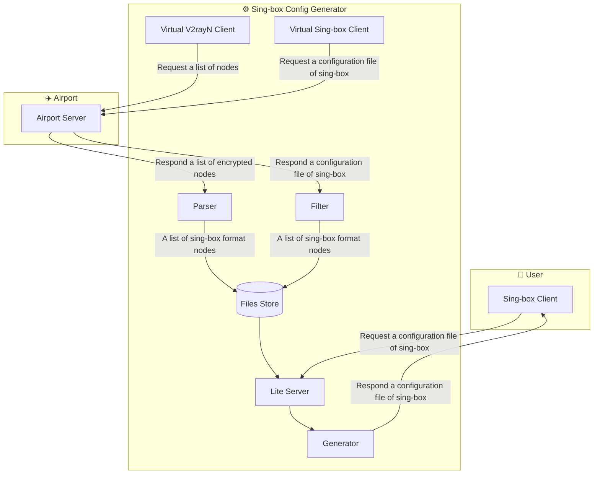

# Sing-box Config Generator

**Languages:** [简体中文](README_zh_cn.md) | [繁體中文](README_zh_hk.md)

## 📋 Description
Due to the relatively aggressive update pace of official sing-box,
many sing-box configuration files distributed by airports through subscriptions are in fact outdated,
and contain many improper settings, making them hard to meet the needs of using the efficient proxy tool sing-box in normal operation and across different usage scenarios.
This project automatically fetches or imports node data, and combines it with highly customizable templates to generate sing-box configuration files,
suitable for a variety of scenarios such as clients, servers, and crawler proxying.

## 💡 Key Highlights
### 🔄 Multi-source Node Ingestion
* **Dual-mode node import**:
    Supports automatically fetching nodes through `airport subscriptions`, and also supports importing `self-hosted node` lists,
    covering different deployment modes such as public airports and self-hosted nodes.
* **Smart node extraction**:
    Automatically parses `sing-box` configuration files or `Base64` node subscriptions distributed by airports,
    extracts node information and converts it into a standard `sing-box` format in a unified way.
### 🧩 Highly Customizable Configuration Generation
* **Template-based configuration generation**:
    Dynamically generates configuration files based on predefined `JSON` templates,
    supporting different runtime environments such as clients, command-line usage, and servers.
* **Flexible node orchestration**:
    Supports custom node ordering, region filtering, name renaming, and region grouping,
    enabling configuration files in different styles according to actual needs.
* **Multi-scenario configuration output**:
    The same set of node data can generate configurations suitable for `Android`, `iOS`, `macOS`,
    `Linux`, `Windows`, and server-side scenarios.
### ⚙️ Automated Deployment
* **Lightweight Web API**: Provides a `RESTful-API`, allowing clients to retrieve the latest configuration files in real time as needed.
* **Automatic airport node synchronization**:
    Combined with `Linux` `systemd timer`, periodically pulls airport subscriptions,
    automatically updates the local node cache without manual maintenance.
* **Secure access control**: Controls configuration file access permissions through `API Token`, preventing unauthorized users from obtaining the configuration content.

## 🏗️ Structure


## 🚀 Usage
### 🔌 Web API
#### GET `/sb_cfg`
Get the sing-box Configuration.
| Param | Options | Default | Required | Description |
| :-: | :-: | :-: | :-: | :-: |
| token |  |  | ✔️ | API token |
| source | airport | ✔️ |  | Load nodes from airport |
|  | diy |  |  | Load nodes from DIY |
| client | app | ✔️ |  |  Configuration for App (Andriod, IOS, Mac official App) |
|  | cli-win |  |  | Configuration for command line in Windows |
|  | cli-linux |  |  | Configuration for command line in Linux |
|  | server |  |  | Configuration for server used to web scraper |
| mainstream_area | true / false | true |  | Using the custom areas nodes instead of all the nodes from airport. Only while `source` is set to `airport` effect. |
| organize_and_rename | true / false | false |  | Using the custom names and positions instead of default names and positions of airport. Only while `source` is set to `airport` effect. |
| area_group | true / false | false |  | Using the area group instead of default non-grouping layout in outbound. Only while `client` is set to `app`, `cli-win`, `cli-linux` effect. |
### 🛠️ Environment
Activate Environment
```sh
uv venv --python /usr/bin/python3 .venv
```
```sh
uv sync
```
```sh
source .venv/bin/activate
```
### ⚙️ Configure
#### Configuration file `config.toml`
Airport subcription url
```toml
airport_url = "https://example.com/sing-box"
```
Allowed tokens
```toml
api_tokens = [
    "jacko",
    "john"
]
```
The areas of the nodes which wanted to inject to Sing-box configuration file
```toml
buildin_area_codes = ["HK", "TW", "SG", "JP", "US"]
```
#### List of DIY nodes `cache/nodes.json`
```json
[
    {
        "tag": "vless_reality",
        "type": "vless",
        ...
    },
    {
        "tag": "hy2",
        "type": "hysteria2",
        ...
    },
    ...
]
```
#### Sing-box configuration file `templates`
* `templates/client.json` client template
* `templates/web_scraper.json` web scraper proxy template
### 🧩 Service
WebAPI service file `/etc/systemd/system/sb_cfg_gen_webapi.service`
```ini
[Unit]
Description=Sing-box Config Genarator Web API
After=network.target
Wants=network.target
Before=shutdown.target

[Service]
Type=simple
User=web_runner
WorkingDirectory=/opt/sb_cfg_gen
ExecStart=/opt/sb_cfg_gen/.venv/bin/sb-web-api

[Install]
WantedBy=multi-user.target
```
Service file which automatically generate airport configration file `/etc/systemd/system/sb_cfg_gen_fetch_nodes.service`
```ini
[Unit]
Description=Sing-box Config Genarator Fetch Nodes
After=network.target

[Service]
Type=oneshot
User=web_runner
WorkingDirectory=/opt/sb_cfg_gen
ExecStart=/opt/sb_cfg_gen/.venv/bin/sb-fetch-nodes
```
Timmer file `/etc/systemd/system/sb_cfg_gen_fetch_nodes.timer`
```ini
[Unit]
Description=Timer for sb_cfg_gen_fetch_nodes.service

[Timer]
OnCalendar=*-*-* 00,12:00:00

[Install]
WantedBy=timers.target
```
Reload
```sh
sudo systemctl daemon-reload
```
Start WebAPI service
```sh
sudo systemctl start sb_cfg_gen_webapi.service
```
```sh
sudo systemctl enable sb_cfg_gen_webapi.service
```
Start timer
```sh
sudo systemctl start sb_cfg_gen_fetch_nodes.timer
```
```sh
sudo systemctl enable sb_cfg_gen_fetch_nodes.timer
```
