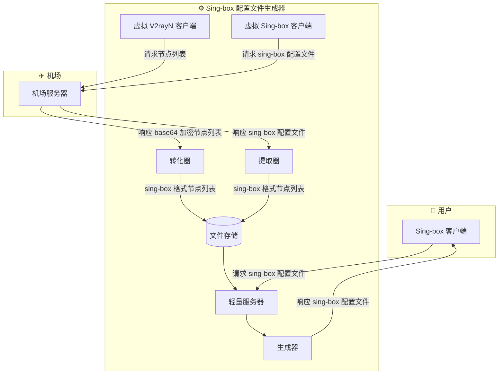

# Sing-box 配置文件生成器

**Languages:** [English](README.md) | [繁體中文](README_zh_hk.md)

## 📋 描述
由于 sing-box 官方更新比较激进，
很多机场通过订阅下发的 sing-box 配置文件实质上过于陈旧，
有许多配置不得当的地方，难以满足正常使用高效代理工具 sing-box 及在不同使用场景的需求。
本项目通过自动获取或导入节点数据，并结合高度可定制的模板生成 `sing-box` 配置文件，
适用于客户端、服务器及爬虫代理等多种场景。

## 💡 核心亮点
### 🔄 多来源节点获取
* **双模式节点导入**：
    支持通过`机场订阅`自动获取节点，也支持导入`自建节点`列表，
    满足公网机场及自建节点等不同部署方式。
* **智能节点提取**：
    自动解析机场下发的 `sing-box` 配置文件或 `Base64` 节点订阅，
    提取节点信息并统一转换为标准 sing-box 格式。
### 🧩 高度可定制配置生成
* **模板化配置生成**：
    基于预定义 `JSON` 模板动态生成配置文件，
    支持客户端、命令行及服务器等不同运行环境。
* **灵活节点编排**：
    支持自定义节点排序、地区筛选、名称重命名及地区分组，
    可按实际需求生成不同风格的配置文件。
* **多场景配置输出**：
    同一份节点数据可生成适用于 `Android`、`iOS`、`macOS`、
    `Linux`、`Windows` 及服务器等不同场景的配置。
### ⚙️ 自动化部署
* **轻量级 Web API**：提供 `RESTful-API`，客户端可按需实时获取最新配置文件。
* **自动同步机场节点**：
    结合 `Linux` 的 `systemd timer` 定时拉取机场订阅，
    自动更新本地节点缓存，无需人工维护。
* **安全访问控制**：通过 `API Token` 控制配置文件访问权限，防止未授权用户获取配置内容。

## 🏗️ 架构


## 🚀 使用方法
### 🔌 Web API
#### GET `/sb_cfg`
获取 sing-box 配置文件.
| 参数 | 选项 | 默认 | 必要项 | 描述 |
| :-: | :-: | :-: | :-: | :-: |
| token |  |  | ✔️ | API token |
| source | airport | ✔️ |  | 通过机场获取节点 |
|  | diy |  |  | 通过自定义获取节点 |
| client | app | ✔️ |  | App 的配置文件 (Andriod, IOS, Mac 官方 App) |
|  | cli-win |  |  | 在 Windows 命令行的配置文件 |
|  | cli-linux |  |  | 在 Linux 命令行的配置文件 |
|  | server |  |  | 在服务器用于爬虫程序的配置文件 |
| mainstream_area | true / false | true |  | 使用自定义的地区节点替代机场默认的所有节点，仅当 `source` 设置为 `airport` 时才生效 |
| organize_and_rename | true / false | false |  | 使用自定义的名称和位置替代机场默认的名称和位置，仅当 `source` 设置为 `airport` 时才生效 |
| area_group | true / false | false |  | 在 outbound 使用地区组替代默认的无组布局，仅当 `client` 设置为 `app`, `cli-win`, `cli-linux` 时才生效 |
### 🛠️ 环境
激活环境
```sh
uv venv --python /usr/bin/python3 .venv
```
```sh
uv sync
```
```sh
source .venv/bin/activate
```
### ⚙️ 配置
#### 配置文件 `config.toml`
机场订阅链接
```toml
airport_url = "https://example.com/sing-box"
```
允许通过的 token
```toml
api_tokens = [
    "jacko",
    "john"
]
```
需要注入 Sing-box 配置文件的节点的地区 
```toml
buildin_area_codes = ["HK", "TW", "SG", "JP", "US"]
```
#### 自建节点列表 `cache/nodes.json`
```json
[
    {
        "tag": "vless_reality",
        "type": "vless",
        ...
    },
    {
        "tag": "hy2",
        "type": "hysteria2",
        ...
    },
    ...
]
```
#### Sing-box 配置文件模板 `templates`
* `templates/client.json` 客户端模板
* `templates/web_scraper.json` 爬虫代理服务器模板
### 🧩 服务
WebAPI 服务文件 `/etc/systemd/system/sb_cfg_gen_webapi.service`
```ini
[Unit]
Description=Sing-box Config Genarator Web API
After=network.target
Wants=network.target
Before=shutdown.target

[Service]
Type=simple
User=web_runner
WorkingDirectory=/opt/sb_cfg_gen
ExecStart=/opt/sb_cfg_gen/.venv/bin/sb-web-api

[Install]
WantedBy=multi-user.target
```
自动生成机场配置文件的服务文件 `/etc/systemd/system/sb_cfg_gen_fetch_nodes.service`
```ini
[Unit]
Description=Sing-box Config Genarator Fetch Nodes
After=network.target

[Service]
Type=oneshot
User=web_runner
WorkingDirectory=/opt/sb_cfg_gen
ExecStart=/opt/sb_cfg_gen/.venv/bin/sb-fetch-nodes
```
计时文件 `/etc/systemd/system/sb_cfg_gen_fetch_nodes.timer`
```ini
[Unit]
Description=Timer for sb_cfg_gen_fetch_nodes.service

[Timer]
OnCalendar=*-*-* 00,12:00:00

[Install]
WantedBy=timers.target
```
重载
```sh
sudo systemctl daemon-reload
```
开启 WebAPI 服务
```sh
sudo systemctl start sb_cfg_gen_webapi.service
```
```sh
sudo systemctl enable sb_cfg_gen_webapi.service
```
开启计时服务
```sh
sudo systemctl start sb_cfg_gen_fetch_nodes.timer
```
```sh
sudo systemctl enable sb_cfg_gen_fetch_nodes.timer
```
