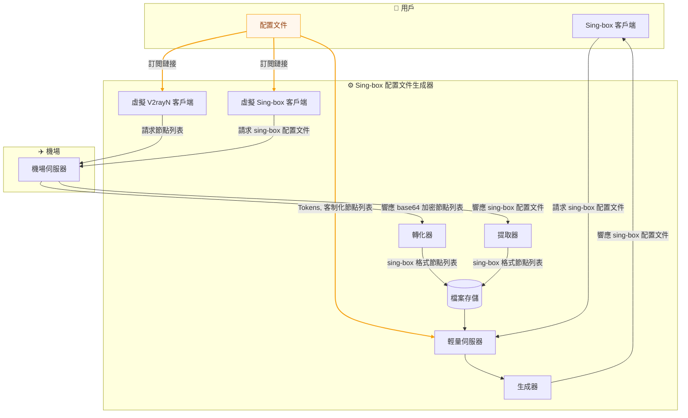

# Sing-box 配置文件生成器

**Languages:** [简体中文](README_zh_cn.md) | [English](README.md)

## 📋 描述
由於 sing-box 官方更新較為激進，
不少機場透過訂閱下發的 sing-box 配置文件，實際上都已經過時，
而且存在不少配置不當的地方，難以滿足正常使用高效代理工具 sing-box 及不同使用場景的需求。
本項目通過自動獲取或匯入節點資料，並結合高度可定制的模板生成 sing-box 配置文件，
適用於客戶端、伺服器及爬蟲代理等多種場景。

> **免責聲明：**
> 1. 本項目嚴格遵守法律法規及 MIT 開源協議。
> 2. 任何第三方 Fork 或基於本項目二次開發之衍生項目，其行為均屬開發者之個人行為，概與本項目及原作者無關。
> 3. 開發者須自行承擔因使用或修改本代碼而產生之一切法律責任。
> 4. 本項目僅作技術研究之用，不鼓勵任何個人或組織透過代理爬蟲繞過網站接口限制，進行非法爬取以牟利。

## 💡 核心亮點
### 🔄 多來源節點獲取
* **雙模式節點導入**：
    支援透過`機場訂閱`自動獲取節點，亦支援匯入`自建節點`列表，
    滿足公網機場及自建節點等不同部署方式。
* **智能節點提取**：
    自動解析機場下發的 `sing-box` 配置文件或 `Base64` 節點訂閱，
    提取節點資訊並統一轉換為標準 `sing-box` 格式。
### 🧩 高度可定制配置生成
* **模板化配置生成**：
    基於預先定義的 `JSON` 模板動態生成配置文件，
    支援客戶端、命令列及伺服器等不同運行環境。
* **靈活節點編排**：
    支援自定節點排序、地區篩選、名稱重命名及地區分組，
    可按實際需要生成不同風格的配置文件。
* **多場景配置輸出**：
    同一份節點資料可生成適用於 `Android`、`iOS`、`macOS`、
    `Linux`、`Windows` 及伺服器等不同場景的配置。
### ⚙️ 自動化部署
* **輕量級 Web API**：提供 `RESTful-API`，客戶端可按需即時獲取最新配置文件。
* **自動同步機場節點**：
    結合 `Linux` 的 `systemd timer` 定時拉取機場訂閱，
    自動更新本地節點快取，無需人工維護。
* **安全訪問控制**：透過 `API Token` 控制配置文件訪問權限，防止未授權用戶獲取配置內容。

## 🏗️ 架構


## 🚀 使用方法
### 🔌 Web API
#### GET `/sb_cfg`
獲取 sing-box 配置文件.
| 參數 | 選項 | 默認 | 必要項 | 描述 |
| :-: | :-: | :-: | :-: | :-: |
| token |  |  | ✔️ | API token |
| source | airport | ✔️ |  | 透過機場獲取節點 |
|  | diy |  |  | 透過客制化獲取節點 |
| client | app | ✔️ |  | App 的配置文件 (Andriod, IOS, Mac 官方 App) |
|  | cli-win |  |  | 在 Windows 命令行的配置文件 |
|  | cli-linux |  |  | 在 Linux 命令行的配置文件 |
|  | server |  |  | 在伺服器用於爬蟲程式的配置文件 |
| mainstream_area | true / false | true |  | 使用客制化的**地區**節點替代機場默認的所有節點，僅當 `source` 設置為 `airport` 時才生效 |
| sort | true / false | true |  | 使用客制化的**位置**替代機場默認的位置，僅當 `source` 設置為 `airport` 時才生效 |
| rename | true / false | true |  | 使用客制化的**名稱**替代機場默認的名稱，僅當 `source` 設置為 `airport` 時才生效 |
| area_group | true / false | false |  | 在 outbound 使用**地區組**替代默認的無組佈局，僅當 `client` 設置為 `app`, `cli-win`, `cli-linux` 時才生效 |
### 🛠️ 環境
激活環境
```sh
uv venv --python /usr/bin/python3 .venv
```
```sh
uv sync
```
```sh
source .venv/bin/activate
```
### ⌨️ 命令行
#### 獲取節點
指定訂閲鏈接
```sh
sb-fetch-nodes --url "https://example.com/subscribe/..."
```
默認從配置文件獲取
```sh
sb-fetch-nodes
```
#### Web API
```sh
sb-web-api
```
### ⚙️ 配置
#### 配置文件 `config.toml`
機場訂閲鏈接
```toml
airport_url = "https://example.com/sing-box"
```
容許通過的 token
```toml
api_tokens = [
    "jacko",
    "john"
]
```
需要注入 Sing-box 配置文件的節點的地區 
```toml
buildin_area_codes = ["HK", "TW", "SG", "JP", "US"]
```
#### 自建節點列表 `cache/nodes.json`
```json
[
    {
        "tag": "vless_reality",
        "type": "vless",
        ...
    },
    {
        "tag": "hy2",
        "type": "hysteria2",
        ...
    },
    ...
]
```
#### Sing-box 配置文件模板 `templates`
* `templates/client.json` 客戶端模板
* `templates/web_scraper.json` 爬蟲代理伺服器模板
### 🧩 服務
WebAPI 服務文件 `/etc/systemd/system/sb_cfg_gen_webapi.service`
```ini
[Unit]
Description=Sing-box Config Genarator Web API
After=network.target
Wants=network.target
Before=shutdown.target

[Service]
Type=simple
User=web_runner
WorkingDirectory=/opt/sb_cfg_gen
ExecStart=/opt/sb_cfg_gen/.venv/bin/sb-web-api

[Install]
WantedBy=multi-user.target
```
自動生成機場配置文件的服務文件 `/etc/systemd/system/sb_cfg_gen_fetch_nodes.service`
```ini
[Unit]
Description=Sing-box Config Genarator Fetch Nodes
After=network.target

[Service]
Type=oneshot
User=web_runner
WorkingDirectory=/opt/sb_cfg_gen
ExecStart=/opt/sb_cfg_gen/.venv/bin/sb-fetch-nodes
```
計時文件 `/etc/systemd/system/sb_cfg_gen_fetch_nodes.timer`
```ini
[Unit]
Description=Timer for sb_cfg_gen_fetch_nodes.service

[Timer]
OnCalendar=*-*-* 00,12:00:00

[Install]
WantedBy=timers.target
```
重載
```sh
sudo systemctl daemon-reload
```
開啓 WebAPI 服務
```sh
sudo systemctl start sb_cfg_gen_webapi.service
```
```sh
sudo systemctl enable sb_cfg_gen_webapi.service
```
開啓計時服務
```sh
sudo systemctl start sb_cfg_gen_fetch_nodes.timer
```
```sh
sudo systemctl enable sb_cfg_gen_fetch_nodes.timer
```
